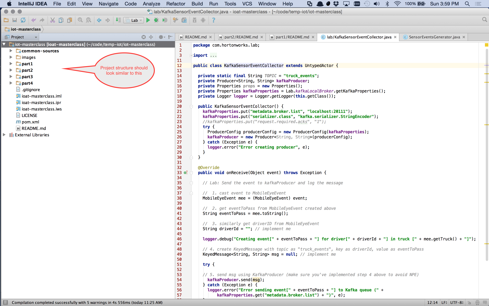

# Part 1: Set up development environment, generate events and push to Kafka


## Environment Setup

### Software Prerequisites 

Please make sure you have the following installed on your machine. Install them in the same order as listed here if you 
don't.

  * [Oracle JDK Standard Edition 7+](http://www.oracle.com/technetwork/java/javase/downloads/index.html)
  * [Apache Maven 3.2+](https://maven.apache.org/download.cgi)
  * [Git](https://git-scm.com/downloads)
  * [IntelliJ IDEA](https://www.jetbrains.com/idea/download/), [Eclipse](https://eclipse.org/downloads/) or [Netbeans](https://netbeans.org/downloads/)
  
> IntelliJ IDEA is preferred but any IDE will work as the labs use Maven. IntelliJ Community edition is free. 


### Installing Hadoop Mini Clusters
 
This master class uses Shane Kumpf's [Hadoop Mini Clusters](https://github.com/sakserv/hadoop-mini-clusters) to start Kafka, Storm, etc. in a local mode. I've 
uploaded a slightly changed version of Shane's Mini Clusters project on my Github [repository](https://github
.com/DhruvKumar/hadoop-mini-clusters.git) to get around some Maven Shade plugin issues.
 
You'll need to get a copy of it first and install the jar locally before doing anything else. 

If you're on a Mac or Linux, open the terminal and do the following to download and install the mini clusters from my
 repository:

```bash
$ git clone https://github.com/DhruvKumar/hadoop-mini-clusters.git
$ cd hadoop-mini-clusters
$ mvn clean install -DskipTests
```

If you're using Windows:

1. Download the Hadoop Mini Clusters project using _one_ of the following methods:
 * Use the Git client and clone the project from https://github.com/DhruvKumar/hadoop-mini-clusters.git
 * Or, download the project as a zipped file from [this link.](https://github
 .com/DhruvKumar/hadoop-mini-clusters/archive/master.zip). Unzip the folder and note the location.
2. Open the command prompt from Start menu, or run `cmd` to get to it.
3. Navigate to the directory in Command Terminal where you have cloned or downloaded the mini clusters.
4. Type: `mvn clean install -DskipTests`. 

> **Note** From now on, I'll assume you're working on a Mac or Linux. In Windows, the maven 
commands will be the same, but system commands like changing directory will be different.

This should install `hadoop-mini-clusters-0.0.15-SNAPSHOT.jar` in your local Maven repository. You can check if its 
correctly installed on Mac OS X and Linux by checking the local `.m2` folder like this:

```bash
$ ls -alh ~/.m2/repository/com/github/sakserv/hadoop-mini-clusters/0.0.15-SNAPSHOT/
total 261776
drwxr-xr-x  9 dkumar  staff   306B Oct 11 10:24 .
drwxr-xr-x  8 dkumar  staff   272B Sep 27 11:42 ..
-rw-r--r--  1 dkumar  staff   321B Sep 27 11:42 _remote.repositories
-rw-r--r--  1 dkumar  staff   256K Sep 27 11:42 hadoop-mini-clusters-0.0.15-SNAPSHOT-javadoc.jar
-rw-r--r--  1 dkumar  staff    20M Sep 27 11:42 hadoop-mini-clusters-0.0.15-SNAPSHOT-sources.jar
-rw-r--r--  1 dkumar  staff   108M Sep 27 11:42 hadoop-mini-clusters-0.0.15-SNAPSHOT.jar
-rw-r--r--  1 dkumar  staff    10K Sep 27 11:42 hadoop-mini-clusters-0.0.15-SNAPSHOT.pom
-rw-r--r--  1 dkumar  staff   1.1K Sep 27 11:42 maven-metadata-local.xml
-rw-r--r--  1 dkumar  staff   355B Oct 11 10:24 resolver-status.properties
```

In Windows, the `m2` folder is usually present at `c:\Users\<username>\.m2`. Navigate to it, and check if the jar is 
present under the `repository\com\github\sakserv\hadoop-mini-clusters\0.0.15-SNAPSHOT\` folder.

> **Important** Make sure that the `0.0.15-SNAPSHOT` version is installed. The SNAPSHOT suffix is very important as it 
differentiates this copy from the original project.
 
### Downloading the Master Class Labs

Now that the Hadoop Mini Clusters project is installed, let's download the masterclass and its labs: 

```bash
$ git clone https://github.com/DhruvKumar/iot-masterclass.git
```

Windows users should download via the Git client or directly as a [Zipped folder](https://github
.com/DhruvKumar/iot-masterclass/archive/master.zip).
 

### Setting up the IDE

Next, let's bring the masterclass labs into our IDE. There are two broad ways to do this:

1. Recommended: Manually import as a Maven project into the IDE.
2. Generate IDE specific project file using Maven, and open the project file.

#### Approach 1: Maven import into IDE

This is recommended. Just open up your IDE, and create a new project/workspace/module etc from the masteclass root 
pom.xml file. This will bring all the parts and the labs into your IDE.

#### Approach 2: Generate IDE specific project files

Alternatively, you can generate Intellij IDEA or Eclipse specific project file using Maven and open them up from IDEA
 or Eclipse. Here's how you can do it for IntelliJ:
 
```bash
$ cd iot-masterclass
$ mvn idea:project
```
This will generate a new `iot-masterclass.ipr` file which can be opened by IntelliJ. You can also open it directly 
from the command line in IntelliJ:

```
$ open iot-masterclass.ipr
```

> If IntelliJ prompts in a notification pop up to treat the pom.xml as a maven project, click on yes.

Similarly, you can generate Eclipse project files by doing:

```bash
$ cd iot-masterclass
$ mvn eclipse:eclipse
```

Here's how the master class looks like in my IntelliJ after importing:



For more details, see IDEA [plugin](https://maven.apache.org/plugins/maven-idea-plugin/) and Eclipse [plugin]
(https://maven.apache.org/plugins/maven-eclipse-plugin/) 
documentation.

## Lab: Generate Events and Stream to Kafka

With the IDE set up correctly and project imported, let's do the first part. 

In a real IoAT app, the events will be generated by some machine sensors. We are going to simulate the event generation 
using Akka, a powerful Actor based library and we'll pass them into Kafka.

Open the class `com.hortonworks.lab.Lab`. Let's walk through the code:

First, we set up and start local mode Zookeeper and Kafka Clusters:

```java
    final ZookeeperLocalCluster zookeeperLocalCluster = new ZookeeperLocalCluster.Builder()
        .setPort(Integer.parseInt(propertyParser.getProperty(ConfigVars.ZOOKEEPER_PORT_KEY)))
        .setTempDir(propertyParser.getProperty(ConfigVars.ZOOKEEPER_TEMP_DIR_KEY))
        .setZookeeperConnectionString(propertyParser.getProperty(ConfigVars.ZOOKEEPER_CONNECTION_STRING_KEY))
        .build();

    kafkaLocalBroker = new KafkaLocalBroker.Builder()
        .setKafkaHostname(propertyParser.getProperty(ConfigVars.KAFKA_HOSTNAME_KEY))
        .setKafkaPort(Integer.parseInt(propertyParser.getProperty(ConfigVars.KAFKA_PORT_KEY)))
        .setKafkaBrokerId(Integer.parseInt(propertyParser.getProperty(ConfigVars.KAFKA_TEST_BROKER_ID_KEY)))
        .setKafkaProperties(new Properties())
        .setKafkaTempDir(propertyParser.getProperty(ConfigVars.KAFKA_TEST_TEMP_DIR_KEY))
        .setZookeeperConnectionString(propertyParser.getProperty(ConfigVars.ZOOKEEPER_CONNECTION_STRING_KEY))
        .build();


    try {
      zookeeperLocalCluster.start();
      kafkaLocalBroker.start();
    } catch (Exception e) {
      LOG.error("Couldn't start the services: " + e.getMessage());
      e.printStackTrace();
    }
```

Now we need to create an Akka actor for generating events. Most of the event simulation machinery is already given to
you under the `common-sources` folder. Study those classes to understand how events can be simulated. 

### Lab Tasks
You need to do two things in order to finish the labs in this part:
 
 * **Task 1:** Using `com.hortonworks.labutils.SensorEventsGenerator`, generate events. Fill out the missing code 
 block in the Lab class. 
 * **Task 2:** Implement the  `KafkaSensorEventCollector.onReceive()` method of the `com.hortonworks.lab
 .KafkaSensorEventsCollector` class.
 
 Once implemented, you can just run `com.hortonworks.lab.Lab.main()` method from the IDE to see the output. 
 
 **Important** Each time you execute this or labs in other parts, you'll get a `tmp` folder in the root directory of 
 the project (`iot-masterclass/tmp`). That folder is used by Zookeeper and Kafka to persist their state, but must be 
 removed before _**each**_ run to avoid state conflict. You'll get confusing results and errors if you don't do this.
 
### Expected Output

You can run the complete solution class's main method to see the output. Run `com.hortonworks.solution.Lab.main()`.

In the output window, you should first see Zookeeper and Kafka starting up:

```bash
[main] INFO com.github.sakserv.minicluster.impl.ZookeeperLocalCluster - ZOOKEEPER: Starting Zookeeper on port: 22010
[Thread-0] INFO org.apache.zookeeper.server.ZooKeeperServerMain - Starting server
...
...
[main] INFO com.github.sakserv.minicluster.impl.KafkaLocalBroker - KAFKA: Starting Kafka on port: 20111
2015-10-11 17:10:12,778 INFO  [main] server.KafkaServer (Logging.scala:info(68)) - starting
```

Next, you should see the kml routes being parsed:

```bash
2015-10-11 17:10:13,362 INFO  [main] route.TruckRoutesParser (TruckRoutesParser.java:parseRoute(29)) - Processing Route File[/Users/dkumar/code/iot-masterclass/part1/target/classes/routes/midwest/A-Saint Louis to Tulsa.kml]
2015-10-11 17:10:13,687 INFO  [main] route.TruckRoutesParser (TruckRoutesParser.java:parseRoute(50)) - Route File[/Users/dkumar/code/iot-masterclass/part1/target/classes/routes/midwest/A-Saint Louis to Tulsa.kml] has 33 coordinates in the route 
...
...
2015-10-11 17:10:13,920 INFO  [main] transport.TruckConfiguration (TruckConfiguration.java:parseRoutes(61)) - 25 truck Routes were parsed
```

After that, you'll see logging for event simulation starting up:

```bash
Number of Emitters is .....23
akka://EventSimulator/user/eventCollector
2015-10-11 17:10:19,315 INFO  [EventSimulator-akka.actor.default-dispatcher-2] masters.SimulationMaster (SimulationMaster.java:<init>(26)) - Starting simulation with 23 of class com.hortonworks.simulator.impl.domain.transport.Truck Event Emitters -- class com.hortonworks.simulator.impl.domain.transport.Truck
```
Soon, you should see the actual truck events being generated:

```bash
015-10-11 17:10:19,339 INFO  [EventSimulator-akka.actor.default-dispatcher-6] transport.Truck (Truck.java:<init>(43)) - New Truck Instance[43] with Driver[Ryan Templeton] has started  new Route[Memphis to Little Rock Route 2], RouteId[1594289134]
2015-10-11 17:10:19,341 INFO  [EventSimulator-akka.actor.default-dispatcher-2] masters.SimulationMaster (SimulationMaster.java:onReceive(41)) - Starting Simulation
2015-10-11 17:10:19,352 INFO  [EventSimulator-akka.actor.default-dispatcher-17] route.RouteProvided (RouteProvided.java:getNextLocation(34)) - Revering Direction..
```

Stop the execution in the IDE, and delete the `tmp` directory from the root folder if present. This finishes part 1.

> **Important** Delete the `tmp` folder from the root directory of the project manually otherwise the persisted data 
will cause problems in the next iterations of the lab.


